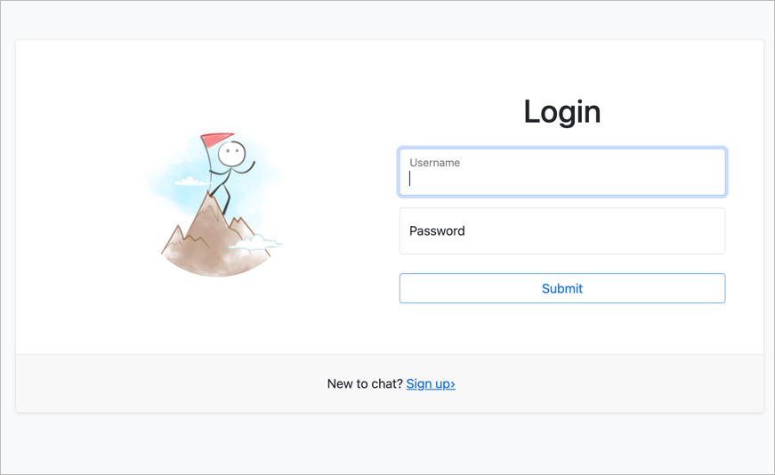
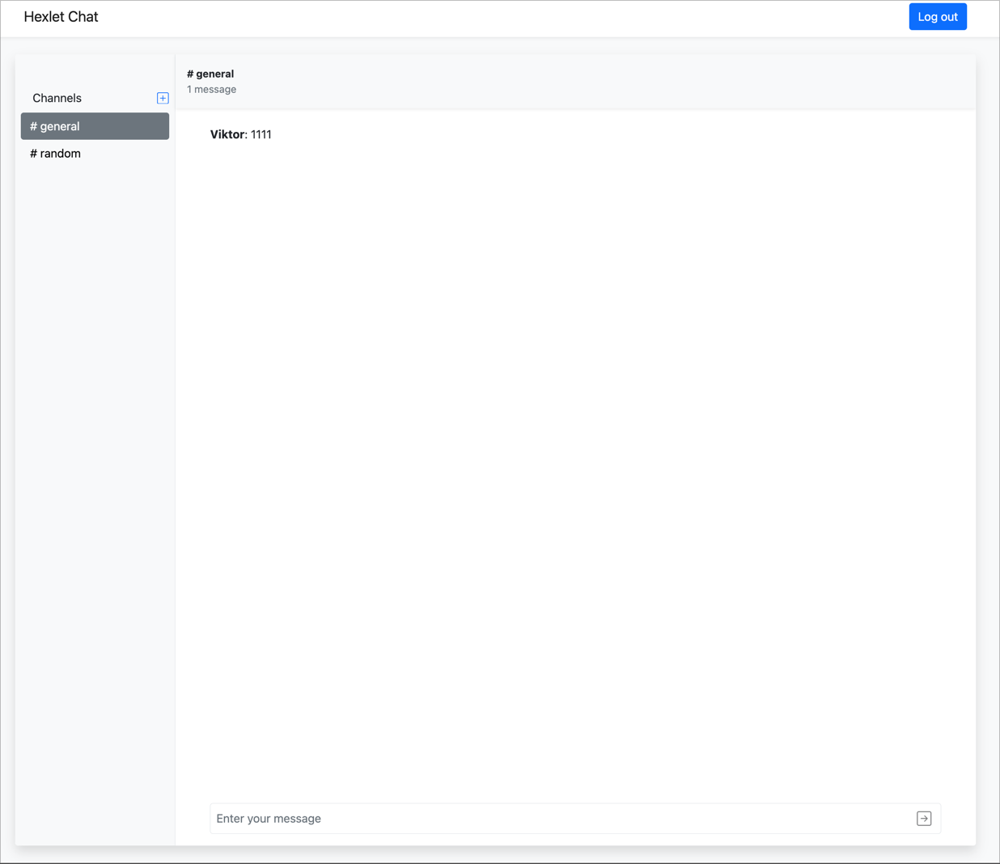
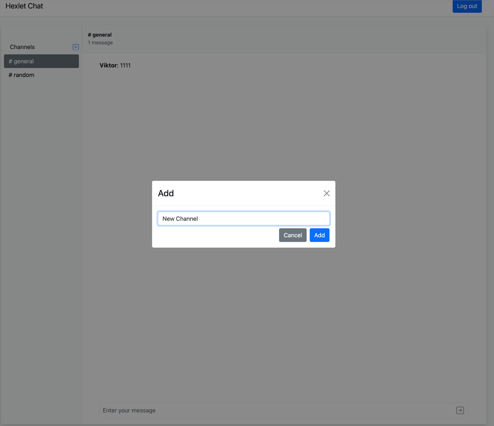
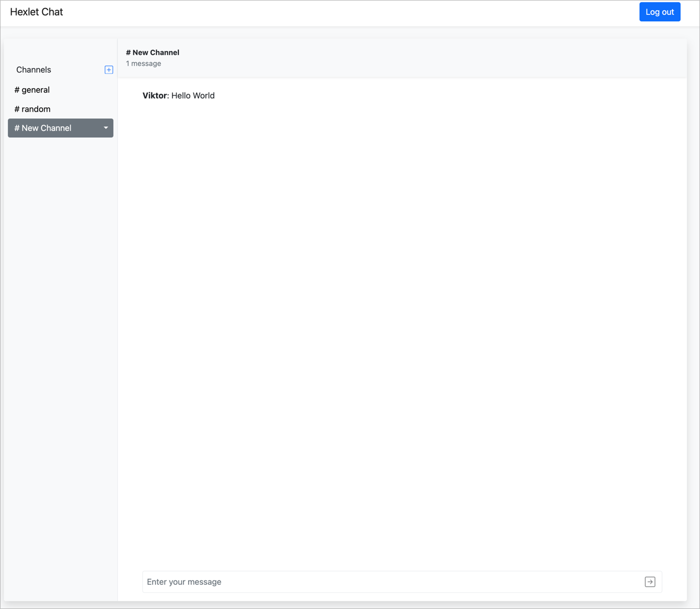

### Hexlet tests and linter status:
[](https://github.com/kasapvictor/frontend-project-lvl4/actions)

```bash
# kill process on port 5001 MacOS 
sudo lsof -i :5001
```
### Libraries
- React Bootstrap
- Redux Toolkit
- Socket.IO
- i18Next
- Axios
- Formik
- Yup
- React Toastify
- ESLint
- Prettier

### Screenshots






